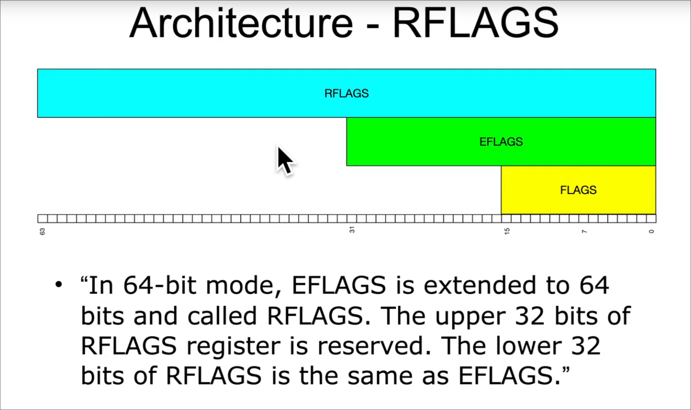

Two forms of control flow: 

Conditionals: 
- go somewhere if a condition is mets 
    - if
    - switch 
    - loop


Unconditionals: 
- Always go somewhere 
    - function calls, goto, exception, interrupts 


function calls use 
`call func_name` and `ret`


GotoExample: 
```c 
#include <stdio.h>
int main(void) {
    goto mylabel; 
    printf("skipped\n");
mylabel: 
    printf("goto ftw!\n");
    return 0xb01dface;
}

```

```asm
# Microsoft Visual studio asm
# compiled with cl.exe
main: 
    sub rsp, 28h 
    ; = 0x28 
    ; h is for hex
    jump 0000000000140000001012 ; or something like that
    lea rcx [some value]
    call printf_address
$mylabel: 
    lea rcx [some other value]
    call printf_address
    mov eax, 0xb01dface 
    add rsp, 28
    ret 

# it use 
    0123ABCh 
; rather then 
    0x123abc 
```


---
# jmp instruction

Unconditional change rip to given address. 

Ways to specify the addres: 
## short form
- Short, relative: (Rip = RIP of next instruction + 1 byte sign-exented-to-64bits displacement)
    - frequently used in small loops. 
    - some dissassembler will indicate this with a mnemonic writing it as "jmp short"
    - jmp -2 == infinite loop for short relative jump  (only does itself. jump -2 is a two byte instruction. 1 byte for jump, 1 for -2)
        - so it doesn't does itself and the previous instruction or some padding. just itself
    - “jmp 0000000140001012” doesn’t have the number
        0000000140001012 anywhere in it, it’s really “jmp 0x0C bytes forward”
        - The assembler has it's own pseudo instruction and optimisations. This will just be encoded as the relative number 
        - of 140001012 and itself and will just say jump (diff). 


## Near form: 
- Near relative (rip = rip of next instruction +4 byte sign-exented-to-64bits)
- Near, absolute indirect (address calculated with r/m64)


## Far form
- Far, absolute indirect form: In another class


```asm
.intel_syntax noprefix
.global main
.extern printf

main:
    ; --- setup stack for calling printf (System V) ---
    sub rsp, 8*4          ; shadow space + stack alignment

    ; ========== Short jump ==========
    ; Jump 2 bytes ahead (small loop / skip)
    jmp short skip1        ; short relative jump (1-byte opcode + 1-byte displacement)

    ; This instruction is skipped
    lea rdi, [rel msg1]
    call printf

skip1:
    ; --- Near jump (relative, 32-bit displacement) ---
    ; Can jump further than short
    jmp near skip2         ; relative jump, rip + 4-byte displacement

    lea rdi, [rel msg2]    ; skipped
    call printf

skip2:
    ; --- Absolute indirect jump (near) ---
    ; Jump to an address stored in a register
    lea rax, [rel msg3]    ; address in rax
    jmp rax                ; indirect jump, absolute

    ; --- Infinite loop example (short jump -2) ---
loop_start:
    jmp short loop_start   ; infinite loop, 2-byte instruction (opcode + offset)

    add rsp, 8*4           ; restore stack
    mov eax, 0xb01dface
    ret

.section .rodata
msg1: .asciz "Short jump skipped\n"
msg2: .asciz "Near jump skipped\n"
msg3: .asciz "Absolute indirect jump executed\n"


```

```asm
.intel_syntax noprefix
.global main
.extern printf

main:
    sub rsp, 8*4           ; stack alignment

    ; ------------------------
    ; Example 1: Short jump
    ; ------------------------
    jmp short short_skip
    lea rdi, [rel msg1]    ; skipped
    call printf

short_skip:
    lea rdi, [rel msg2]
    call printf

    ; ------------------------
    ; Example 2: Near jump
    ; ------------------------
    jmp near near_skip
    lea rdi, [rel msg3]    ; skipped
    call printf

near_skip:
    lea rdi, [rel msg4]
    call printf

    ; ------------------------
    ; Example 3: Absolute indirect jump through memory
    ; jmp [rax + rcx*2 + 0x80123abc]
    ; ------------------------
    ; We'll fake it with a local variable for demo
    lea rax, [rel jump_target]   ; base address
    mov rcx, 0                   ; index = 0
    jmp qword ptr [rax + rcx*2 + 0] ; memory operand, reads 8 bytes as target

jump_target:
    .quad target_func             ; store the address of function to jump
    ; bad style, we have a value in .text. 

target_func:
    lea rdi, [rel msg5]
    call printf
    ret

    ; ------------------------
    ; End program
    ; ------------------------
    add rsp, 8*4
    mov eax, 0xb01dface
    ret

.section .rodata
msg1: .asciz "This is skipped by short jump\n"
msg2: .asciz "Executed after short jump\n"
msg3: .asciz "Skipped by near jump\n"
msg4: .asciz "Executed after near jump\n"
msg5: .asciz "Jumped through absolute memory address\n"


```


gas syntax. jump 1b:
```asm
.intel_syntax noprefix
.global main
.extern printf

main:
    sub rsp, 8*4           ; stack alignment

    ; ------------------------
    ; Example 1: Short jump with numeric forward label
    ; ------------------------
    jmp 1f                 ; jump forward to the next label '1:'
    lea rdi, [rel msg1]    ; skipped
    call printf

; We can and are allowed/supposed to have multiple numeric label in the same file
; hence the 1f and 1b (forward/backward requirement)
1:                          ; numeric label 1, forward target
    lea rdi, [rel msg2]
    call printf

    ; ------------------------
    ; Example 2: Short jump with numeric backward label
    ; ------------------------
2:                          ; numeric label 2, backward target
    lea rdi, [rel msg3]
    call printf

    jmp 2b                 ; jump backward to the most recent '2:' label
    ; infinite loop, will keep printing msg3

    ; ------------------------
    ; Example 3: Using named labels instead
    ; ------------------------
named_start:
    lea rdi, [rel msg4]
    call printf

    jmp named_end           ; forward jump using named label

named_middle:
    lea rdi, [rel msg5]
    call printf             ; skipped

named_end:
    lea rdi, [rel msg6]
    call printf

    ; ------------------------
    ; End program
    ; ------------------------
    add rsp, 8*4
    mov eax, 0xb01dface
    ret

.section .rodata
msg1: .asciz "Skipped by 1f\n"
msg2: .asciz "Executed after 1f\n"
msg3: .asciz "Looping in 2b\n"
msg4: .asciz "Named start\n"
msg5: .asciz "Skipped named middle\n"
msg6: .asciz "Named end\n"

```


gas intel hard coded jumps: 
```asm 
.intel_syntax noprefix
.global _start

_start:
    ; short jump forward 2 bytes
    jmp $+2
    nop         ; skipped

    ; short jump backward (infinite loop)
loop_start:
    jmp $-2

```

gas support atnt (it's default). 
The \$ sign is intel syntax only. means current line
. is used at assembly time. not runtime. 
. is for the current location counter. 
atnt syntax doesn't have the \$ sign. So no hardcoded relative jump. 
nasm doesn't support atnt


and 

```asm 
jmp -2 
```
is how it's encoded in bytes, but it won't be accepted anywhere


---
# Other Control Flow assembly instructions: 

- cmp (compare)
- jne (jump not equal)
- je  (jump equal)
- jle (jump less then or equal) 
- jge (jump greater then or equal)
- jnz (jump not zero)
- jz (jump if zero)
- There's a ton of jump instructions, just let the asm lsp show you all of them by typing j and letting autocomplete to its job

    - A bunch of them are synonyms. Different names for the same thing. Or identity pseudo instructions
    - jnz = jne: Jump if not zero. They both check the if zero flag (zf) == 0

## What is the zero flags: 

---
# Architecture - RFLAGS
../../../arch1001_x86-64_asm_slides_and_subtitles/07_ControlFlow/_Arch1001_07_ControlFlow_03_IfExample2.pdf
<!--  -->
this cause bugs so fuck it

rflags is an 64bit extension of eflags (which is 32 bit)
which is an extension of a flags register (16 bit.)

The upper 32 bit of rflags is reserved. 
The lower 32 bit of rflags is the same as eflags
- TLDR: We are still just using the eflags register. The extension is to say it was done, but it's not used.


---
The rflags register holds many single bits flags. 

For now: 
- Zero Flag (ZF). Set if the result of some instruction is 0. cleared otherwise. 
- Sign flag (SF). Set equal to the most significatn bit of the result. Which is the sign bit of a signed integer. 
    - 0 indicate positive value. 1 indicate negative value. 
    - But it doesn't necessarily means sign. Since the cpu doesnt know if it was signed or not. 
    - And it has "kinda" ignored/undefined behavior after certain instructions. 
    - The hardware doesn't know. It's the programmers/compilers job

Optional from chatgpt: 
- CF: Carry flag 
- OF: Overflow flag
- underflow/overflow works depending on the two above with a table im too lazy to write right now. (Too tired)
    - See chatgpt/manual


Some Notable Jcc Instructions
- JZ/JE: if ZF == 1
- JNZ/JNE: if ZF == 0
- JLE/JNG : if ZF == 1 or SF != OF
- JGE/JNL : if SF == OF
- JBE/JNA: if CF \=\= 1 OR ZF \=\= 1
- JB: if CF == 1
- JS: If the sign is 1. (If the last instruction set the most significant bit to 1)


----
# Mnemonic translations: 

- A = Above: Unsigned notion. 
- B = Bellow: unsigned notion. 
- G = Greaten then: Signed notion 
- L = Less then: Signed notion. 
- E = Equal (Same as Z, zero flag set)
- N = Not( like not less then: JNL)


---
# Flag setting: 

- Before you do a conditional jump, you need something to set the contition status flags for you
- Typically done with CMP, TEST or whatever instructions are already inline and happen to have flag-setting side-effects. 
- (Like add and substract) {optional material}


--- 
# CMP: Compare two operands

it's like the sub instruction, but it doesn't store the result. it just does the substraction. 
substract 2nd from 1st
```asm
cmp eax ebx 
res = eax - ebx 
(don't store the result, but check it's sign, if it's 0, and other things and store them in the rflags)
; v : Chatgpt verified
```

modifies: CF: OF, SF, ZF, AF and PF. 


```asm
; my example
cmp eax ebx 
!= jne address (jump if eax != ebx)

cmp dword ptr [rsp+4], eax:
<= (signed) jle address. (jump if *(rsp+4) <=eax )

cmp rcx ebx 
>= (unsigned) jae : (jump if rcx >= ebx {using unsigned >= check})


comp eax, ebx 
jge address
; Use jge if  eax, and ebx are signed integers. 

comp eax, ebx 
jae address 
; use jae if eax and ebx are unsigned integers. 
```

his, both slides
```asm
1:
    cmp dword ptr [rsp+4],  eax 
    jne address 

2: 
    cmp dword ptr [rsp+4],  eax 
    jle address 

3:
    cmp dword ptr [rsp+4], eax:
    jae address


1:
                cmp dword ptr [rsp+4],  eax 
!=              jne address 
; != doesn't care about sign or anything. It surpass types

2: 
                cmp dword ptr [rsp+4],  eax 
<= (signed)     jle address 

3:
                cmp dword ptr [rsp+4], eax:
>= (unsinged)   jae address


1: dword ptr [rsp+4] != eax  ? : If yes then jump
2: dword ptr [rsp+4] <= (signed) eax ? : If yes then jump 
3: dword ptr [rsp+4] >= (unsigned) eax ? : If yes then jump


; Sadly, atnt syntax flips that order too. At least it's consistent in order flipping.
```


We want to jump if eax ≤ ebx (signed comparison).
### 1. Intel Syntax
```asm
cmp eax, ebx    ; computes eax - ebx = 5 - 10 = -5
jle label       ; jump if signed less or equal
```


### 2. AT&T Syntax: 
```asm
cmp %ebx, %eax    # computes %eax - %ebx = 5 - 10 = -5
jle label         # jump if signed less or equal

# so you must read it left to right. 
# ebx => eax is 
# is eax <= ebx. 
```
So they get switched too. As the ;Sadly message said
And again, but at least it's consistent on being backward


